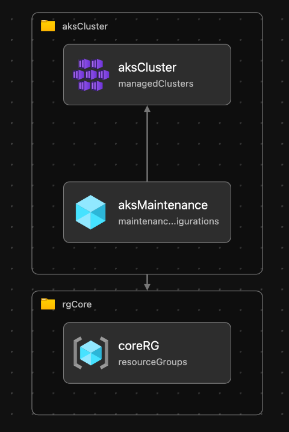

# aks-maintenance-windows

This repository contains Bicep modules to deploy an basic Azure Kubernetes Service with the following specific update settings and enabled maintenance windows:

- Microsoft.ContainerService/managedClusters `autoUpgradeProfile.upgradeChannel: node-image`
- Microsoft.ContainerService/managedClusters `upgradeSettings.maxSurge: 33%`
- Microsoft.ContainerService/managedClusters/maintenanceConfigurations `timeInWeek: Thursday 2-3am UTC`



## Pre-Requisites

### General

- AKS

### Azure CLI

```bash
# Install the aks-preview extension
az extension add --name aks-preview
# Update the extension to make sure you have the latest version installed
az extension update --name aks-preview
# Optional: Setup the Azure CLI extension for cluster extensions
az extension list -o table
```

## Deploy

```bash
# What-if
az deployment sub what-if \
  --name AksBicepDeployment \
  --location westeurope \
  --template-file main.bicep
# Deploy
az deployment sub create \
  --name AksBicepDeployment \
  --location westeurope \
  --template-file main.bicep
```

## Maintenace Configuration CLI commands

```bash
# List all maintenance windows in an existing cluster
az aks maintenanceconfiguration list -g MyResourceGroup --cluster-name myAKSCluster
# Show a specific maintenance configuration window in an AKS cluster
az aks maintenanceconfiguration show -g MyResourceGroup --cluster-name myAKSCluster --name myAKSMaintenanceConfiguration
```

## Useful docs

- [Use Planned Maintenance to schedule maintenance windows](https://docs.microsoft.com/en-us/azure/aks/planned-maintenance)
